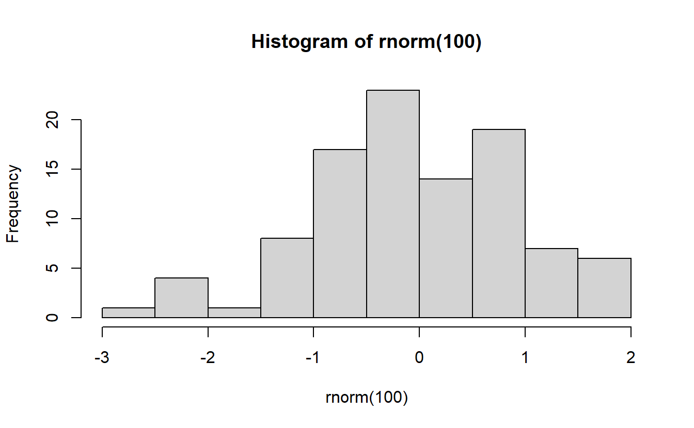

Test

<pre class='chroma'><code class='language-r' data-lang='r'><a href='https://rdrr.io/r/graphics/hist.html'>hist</a>(<a href='https://rdrr.io/r/stats/Normal.html'>rnorm</a>(100))
</code></pre>

